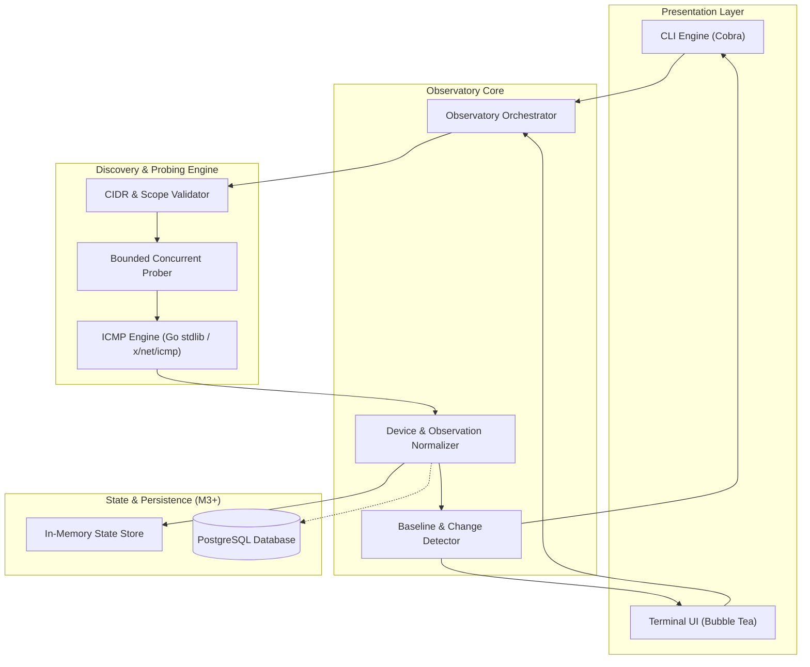

<h1 align="center">LAN Observatory</h1>

<p align="center">
  <strong>Defensive network visibility, device inventory, and historical change tracking.</strong>
</p>

<p align="center">
  A CLI/TUI-first defensive network observability tool written in Go, engineered to discover, inventory, and track changes across authorized local networks over time.
</p>

<p align="center">
  <a href="https://go.dev/">
    
  </a>
  
  
</p>

---

## 📑 Table of Contents

- [What is LAN Observatory?](#-what-is-lan-observatory)
- [Why It Exists](#-why-it-exists)
- [Feature Status](#-feature-status)
- [CLI Examples (Planned)](#-cli-examples-planned)
- [Project Structure](#-project-structure)
- [Architecture](#-architecture)
- [Technology Stack](#-technology-stack)
- [Development & Verification](#-development--verification)
- [Roadmap](#-roadmap)
- [Security & Authorization](#-security--authorization)
- [Contributing](#-contributing)
- [License](#-license)

---

## 🧭 What is LAN Observatory?

**LAN Observatory** (`lanobs`) is a defensive network observability tool designed for discovering, inventorying, and monitoring devices across networks owned by or explicitly authorized for the operator.

Built as a lightweight, CLI/TUI-first application in Go, LAN Observatory goes beyond transient point-in-time IP scans. Its primary objective is to build a reliable, historical baseline of local networks: understanding what devices exist, tracking when they appear or disappear, capturing observable network properties, and auditing how network topologies evolve over time.

LAN Observatory is designed to answer key operational questions:

* **Inventory**: What devices exist on the local network?
* **Liveness**: Which hosts are actively reachable or currently offline?
* **Lifecycle**: When was a device first observed, and when was it last active?
* **Drift**: What changes have occurred across the network over hours, days, or weeks?
* **Identification**: What hostnames, MAC vendors, and services can be legitimately observed?
* **Baseline Health**: Do historical observations reveal unauthorized devices or unexpected configuration changes?

> [!IMPORTANT]
> LAN Observatory is strictly intended for defensive visibility on networks you own or are explicitly authorized to assess. It is **not** an exploit framework, vulnerability scanner, or Nmap clone.

---

## 💡 Why It Exists

Traditional discovery utilities (such as ping sweeps or one-off port scanners) excel at answering a single, immediate question: *What is reachable right now?*

However, home labs, office subnets, and private environments require continuous observability rather than ephemeral snapshots:

* **State and Baseline Over Time**: Ephemeral scans discard history immediately. If an unrecognized device joins at 3:00 AM or a server quietly goes offline, a point-in-time ping scan provides no context. LAN Observatory preserves structured observation runs to highlight state transitions.
* **Defensive Asset Hygiene**: Network security begins with an accurate inventory. LAN Observatory correlates IP addresses, MAC hardware addresses, hostnames, and observed services into durable device entities.
* **Safe, Bounded Probing**: Aggressive scanners can trigger firewall alerts, degrade embedded IoT hardware, or saturate weak wireless links. LAN Observatory enforces strict concurrency bounds, configurable pacing, and deterministic cancellation timeouts.
* **Ergonomic CLI and TUI Delivery**: Operators can run fast, script-friendly queries (`lanobs discover --output json`) in automated workflows or monitor live network states using an interactive terminal user interface (`lanobs tui`).

---

## 📊 Feature Status

### Implemented (Foundation Phase)

- [x] **Project Identity & Scope Specification**: Clear defensive boundaries, security model, and CLI contract defined.
- [x] **Layered Architecture Blueprint**: Decoupled core separation across CLI, discovery engine, inventory normalizer, and storage abstractions.
- [x] **Multi-Milestone Roadmap (M0–M10)**: Phased engineering plan established from initial foundation through Linux daemon distribution.

### Planned (Active Roadmap)

- [ ] **M0 — Project Foundation**: Go module initialization, root Cobra CLI entrypoint (`cmd/lanobs`), `log/slog` structured logging, error handling types, and CI workflow.
- [ ] **M1 — Network Discovery (Initial Vertical Slice)**: CIDR validation, bounded concurrent prober, ICMP echo latency measurements, and normalized table/JSON CLI formatters.
- [ ] **M2 — Device Inventory**: Device state normalization, MAC/OUI vendor lookups, reverse DNS resolution, and first-seen/last-seen tracking.
- [ ] **M3 — Persistent Network History**: PostgreSQL storage adapter (`pgx`, `sqlc`, `golang-migrate`) for persistent discovery runs and historical queries.
- [ ] **M4 — Continuous Observation**: Background scheduled discovery, network baseline diffing, and change event emission.
- [ ] **M5 — Interactive TUI**: Terminal dashboard built with Bubble Tea for live device browsing, filtering, and event streams.
- [ ] **M6 — Local Network Intelligence**: Subnet protocol signals (ARP cache inspection, mDNS discovery, local metadata).
- [ ] **M7 — Service Observation**: Legitimate service observation and port baseline drift tracking without invasive exploitation.
- [ ] **M8 — PCAP Analysis**: Offline packet capture ingestion for forensic host auditing and passive validation.
- [ ] **M9 — Defensive Detection**: Policy-based network deviation alerts (e.g., rogue gateways, duplicate MACs, unexpected open ports).
- [ ] **M10 — Linux Distribution**: Systemd daemon service, Debian packaging (`.deb`), and ARM64 / Raspberry Pi deployments.

---

## 💻 CLI Examples (Planned)

The primary interface to LAN Observatory is the `lanobs` command-line executable.

```bash
# Discover reachable hosts within an authorized subnet
lanobs discover 192.168.1.0/24

# Output discovery results in normalized JSON for automation and scripting
lanobs discover 192.168.1.0/24 --output json

# Display the current normalized device inventory
lanobs inventory

# Inspect detailed history and observation records for a specific host
lanobs device 192.168.1.25

# Query network state transitions and changes detected over the last 24 hours
lanobs changes --since 24h

# Continuously monitor a target subnet with periodic observation sweeps
lanobs watch 192.168.1.0/24 --interval 5m

# Launch the interactive terminal user interface (Bubble Tea)
lanobs tui

# Perform offline inspection of a packet capture file
lanobs pcap inspect capture.pcap
```

> [!NOTE]
> The commands above demonstrate the planned CLI surface defined across milestones M1–M8. As the project is currently in the foundation phase (M0), application commands will be enabled progressively as each milestone is implemented.

---

## 📁 Project Structure

The project follows idiomatic Go package layout conventions:

```text
lan-observatory/
├── .github/
│   └── workflows/
│       └── ci.yml               # Automated CI pipeline (lint, test, govulncheck)
│
├── cmd/
│   └── lanobs/
│       └── main.go              # CLI binary entrypoint & graceful exit handling
│
├── internal/
│   ├── cli/                     # Cobra command tree (root, discover, inventory, etc.)
│   ├── discovery/               # CIDR parsing, bounded concurrency worker pool & ICMP prober
│   ├── inventory/               # Device state normalization, hostname resolution & models
│   ├── storage/                 # Persistence interfaces (in-memory & PostgreSQL adapters)
│   ├── observation/             # Baseline diffing, change detector & event models
│   ├── tui/                     # Bubble Tea models, views, keymaps, and update loops
│   └── telemetry/               # Structured logging setup via log/slog
│
├── pkg/
│   └── netutil/                 # Exportable network calculation and validation utilities
│
├── docs/
│   ├── architecture.md          # Detailed engineering design and layer responsibilities
│   ├── roadmap.md               # Comprehensive milestone specifications and criteria
│   └── security.md              # Security model, operational safety, and authorization rules
│
├── go.mod, go.sum               # Go module dependencies (Go 1.27+)
└── README.md                    # Project documentation
```

### Directory Roles

* **`cmd/lanobs`**: Contains the main entrypoint compiling into the `lanobs` binary.
* **`internal/`**: Houses application business logic protected from external module imports, including discovery primitives, inventory models, and storage adapters.
* **`pkg/`**: Holds modular, general-purpose networking utilities suitable for clean external reuse.
* **`docs/`**: Central repository for detailed architecture, security guidelines, and milestone tracking.

---

## 🏛️ Architecture

LAN Observatory is structured around a decoupled, domain-driven observability core. Both the command-line interface (CLI) and the terminal user interface (TUI) act as thin presentation layers over identical discovery and inventory engines.



### Initial Vertical Slice

Development follows a strict vertical slice approach. The first complete operational pipeline (Milestone 1) is:

```text
CIDR Target Input (e.g. 192.168.1.0/24)
  ↓
Validation & Scope Verification
  ↓
Bounded Concurrent Prober (Worker Pool)
  ↓
ICMP Echo Observations & Round-Trip Latency
  ↓
Normalized Observation Records
  ↓
CLI Output Presentation (Formatted Table / JSON)
```

### Core Design Principles

1. **Defensive by Design**: Built exclusively to observe, baseline, and audit systems you control.
2. **Evidence Before Deduction**: Raw network observations (ping latency, timestamps, DNS responses) are captured objectively before computing derived state or security findings.
3. **Bounded Concurrency**: Every network operation uses bounded goroutine worker pools, deterministic timeouts, and `context.Context` propagation to avoid network exhaustion.
4. **Minimal External Dependencies**: Leverages the Go standard library wherever possible. External packages are introduced only when standard library facilities are insufficient.
5. **No Featuritis**: Avoids unrelated offensive functionality, password guessing, or exploit payloads.

---

## 🛠️ Technology Stack

| Layer | Technology | Purpose |
| :--- | :--- | :--- |
| **Runtime & Language** | Go 1.27+ | Single-binary executable, low memory footprint, first-class concurrency |
| **CLI Framework** | [Cobra](https://github.com/spf13/cobra) | POSIX-compliant command routing, subcommands, and flag parsing |
| **Terminal UI (TUI)** | [Bubble Tea](https://github.com/charmbracelet/bubbletea) | Elm-architecture reactive terminal user interface (M5+) |
| **Networking Primitives** | Go standard library (`net`, `net/netip`) | Subnet parsing, IP math, socket management, and DNS resolution |
| **ICMP Protocol Support** | `golang.org/x/net/icmp` | Low-level ICMP echo packet crafting and parsing where needed |
| **Structured Logging** | `log/slog` | High-performance, contextual JSON and text structured logging |
| **Testing & Verification** | Go `testing`, `-race`, `go vet` | Built-in test execution, race condition detection, and static analysis |
| **Security Scanning** | `govulncheck` | Official Go toolchain vulnerability scanner for dependencies |
| **CI Automation** | GitHub Actions | Automated linting, test suites, and build validation |
| **Relational Storage (M3+)** | PostgreSQL + `pgx` + `sqlc` + `golang-migrate` | Type-safe SQL queries and versioned migrations for persistent history |

> [!NOTE]
> Persistent relational storage is intentionally omitted from the initial milestones (M0–M2) to keep the discovery engine self-contained and zero-dependency. PostgreSQL is introduced in Milestone 3 to support historical tracking and baseline diffing.

---

## 🧪 Development & Verification

### Local Build & Verification

```bash
# Verify and tidy Go module dependencies
go mod tidy
go mod verify

# Run unit and integration tests with the Go race detector
go test -v -race ./...

# Run static analysis and vet checks
go vet ./...

# Check for known vulnerabilities in Go dependencies
govulncheck ./...

# Verify source code formatting
gofmt -l .

# Compile local binary to bin/lanobs
go build -o bin/lanobs ./cmd/lanobs
```

### Linux Network Permissions for ICMP

On Linux platforms, low-level ICMP socket creation may require specific privileges. LAN Observatory supports both unprivileged ICMP ping sockets and raw socket capabilities:

```bash
# Option A: Enable unprivileged ICMP ping sockets (recommended for Linux hosts)
sudo sysctl -w net.ipv4.ping_group_range="0 2147483647"

# Option B: Grant CAP_NET_RAW capability to the compiled binary
sudo setcap cap_net_raw+ep ./bin/lanobs
```

---

## 🗺️ Roadmap

The roadmap organizes implementation into sequential, verifiable milestones:

* **M0 — Project Foundation**: Initialize Go module, project directory layout, root Cobra CLI, `log/slog` logging configuration, CI pipeline, and core error handling.
* **M1 — Network Discovery**: Implement the initial vertical slice: CIDR parsing, bounded concurrency worker pool, ICMP echo probing, latency measurement, and table/JSON CLI formatters.
* **M2 — Device Inventory**: Introduce normalized device entities, MAC address handling, OUI vendor lookups, reverse DNS hostname resolution, and first-seen/last-seen tracking.
* **M3 — Persistent Network History**: Integrate PostgreSQL using `pgx`, `sqlc`, and `golang-migrate` to store discovery runs, device records, and historical states.
* **M4 — Continuous Observation**: Implement recurring observation loops, network baseline diffing, and change event generation (e.g., new device, host offline, IP reassignment).
* **M5 — Interactive TUI**: Build an interactive terminal user interface using Bubble Tea to inspect network topologies, device detail views, and real-time state streams.
* **M6 — Local Network Intelligence**: Expand observation capabilities with local protocol signals (ARP cache inspection, mDNS resolution, and subnet metadata).
* **M7 — Service Observation**: Add legitimate, non-invasive service observation and detect port baseline drift against established service profiles.
* **M8 — PCAP Analysis**: Provide offline packet capture analysis (`.pcap` / `.pcapng`) for historical network auditing and host behavior verification.
* **M9 — Defensive Detection**: Build deterministic security findings based on observed network changes and policy deviations (e.g., unauthorized devices, gateway drift).
* **M10 — Linux Distribution**: Provide production Linux daemon integration, systemd service units, ARM64 / Raspberry Pi builds, and Debian (`.deb`) packages.

---

## 🛡️ Security & Authorization

LAN Observatory is engineered exclusively for authorized defensive network visibility.

### Authorization Prerequisite

Operators must only use LAN Observatory on network segments they own or for which they have received explicit, written permission from the network owner. Conducting unauthorized network discovery or scanning on external, public, or third-party networks is strictly prohibited.

### Defensive Scope Boundaries

LAN Observatory explicitly refuses to implement offensive security techniques, including:

* Credential brute-forcing, password spraying, or dictionary attacks.
* Exploitation payloads, shell delivery, or vulnerability weaponization.
* Defensive evasion, IDS/IPS evasion flags, or packet spoofing.
* Persistence mechanisms on target systems or unauthorized lateral movement.
* Invasive banner grabbing or service fuzzing.

All observation logic is structured to gather non-invasive telemetry necessary for inventory, diagnostics, baseline tracking, and defensive auditing.

For our full security policy and vulnerability disclosure procedures, refer to [`docs/security.md`](docs/security.md).

---

## 🤝 Contributing

Contributions are welcome! Please ensure all contributions adhere to the project's defensive goals:

1. Review the [Security & Authorization](#-security--authorization) principles before proposing network inspection capabilities.
2. Ensure all changes include comprehensive unit tests executed with the Go race detector (`go test -race ./...`).
3. Follow idiomatic Go style, pass `go vet ./...`, and maintain clean `gofmt` formatting.
4. Follow Conventional Commits for commit messages (`feat:`, `fix:`, `docs:`, `refactor:`).

---

## 📄 License

A project license will be selected and added prior to the first public release.
