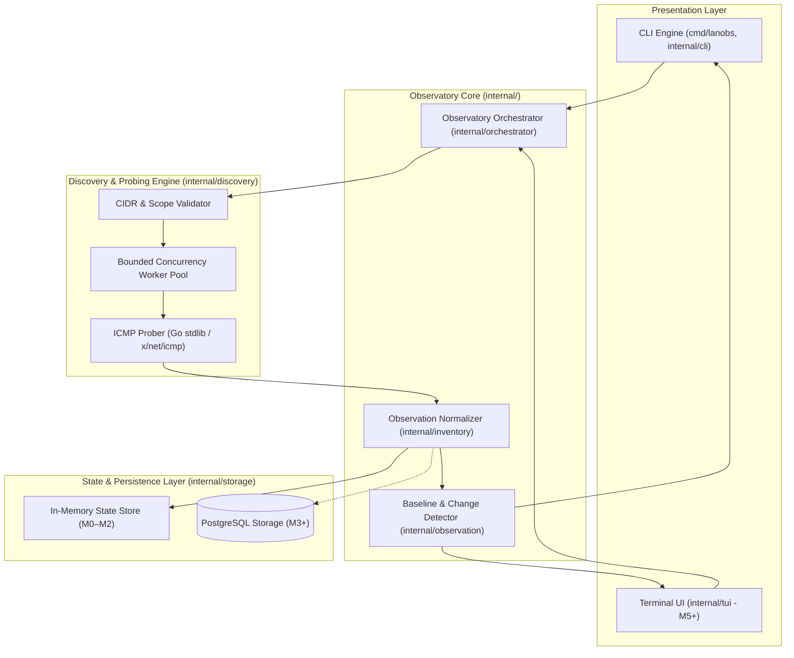

# Architecture Guide — LAN Observatory

This document outlines the architectural principles, component responsibilities, concurrency model, and data flow governing **LAN Observatory** (`lanobs`).

---

## 1. System Philosophy & Core Invariants

LAN Observatory is designed as a **defensive, CLI/TUI-first network observability engine**. It is engineered to build reliable inventories and track historical network changes across authorized local networks.

The system is governed by strict architectural rules:

1. **Decoupled Application Core**: The Command-Line Interface (Cobra) and Terminal User Interface (Bubble Tea) are presentation interfaces over a reusable application core. 
2. **Strict Logic Isolation**: Network logic, socket communication, and probing primitives must **never** live inside TUI rendering code or CLI command functions.
3. **Standard Library Primacy**: Prefer the Go standard library (`net`, `net/netip`, `sync`, `context`, `log/slog`) wherever possible. Third-party networking packages (such as `golang.org/x/net/icmp`) are adopted only when low-level protocol capabilities require it.
4. **Bounded Concurrency & Mandatory Timeouts**: All network probing operations must run under explicit worker pools or rate limiters. Network operations must accept a `context.Context` and enforce deterministic timeouts.
5. **Defensive Network Scope**: Built exclusively to observe and baseline systems under authorized control. The system explicitly excludes offensive capabilities, exploit delivery, credential brute-forcing, and defense-evasion mechanisms.
6. **No Speculative Architecture**: Build only what is needed for the current vertical slice. Avoid premature abstractions, hypothetical plugin systems, or empty packages.
7. **Minimal Dependencies**: Do not introduce PostgreSQL, Docker, Bubble Tea, PCAP parsers, or port scanning tools until their designated milestones.
8. **Vertical Slice Development**: Deliver end-to-end functionality incrementally, starting with the initial discovery slice.

---

## 2. Component Architecture



---

## 3. Package & Layer Responsibilities

### Presentation Layer
* **`cmd/lanobs`**: The process entrypoint. Sets up OS signal handlers (`SIGINT`, `SIGTERM`), initializes structured logging via `log/slog`, and executes the root command.
* **`internal/cli`**: Implements the Cobra command hierarchy (`discover`, `inventory`, `changes`, `watch`, `tui`). Translates CLI flags and arguments into strongly typed domain requests, calling the core engine and formatting output as tabular ASCII or JSON.
* **`internal/tui`** *(Planned M5)*: Implements an interactive terminal dashboard using Bubble Tea. Consumes the identical core domain models without embedding any network or discovery logic.

### Application Core
* **`internal/orchestrator`**: Coordinates discovery runs, schedules sweeps, and manages lifecycle contexts.
* **`internal/inventory`**: Defines normalized domain models (`Device`, `Observation`, `HostState`). Normalizes raw probe outcomes, performs reverse DNS resolution and OUI vendor mapping, and maintains first-seen / last-seen timestamps.
* **`internal/observation`**: Analyzes historical and current observation runs to compute network baseline diffs (e.g. host joined, host disappeared, IP changed).

### Discovery & Probing Engine
* **`internal/discovery`**: Enforces CIDR validation, decomposes subnets into target IP sequences, manages bounded worker pools, and conducts ICMP echo requests and latency measurements.
* **`pkg/netutil`**: Modular, exportable network utilities (IP iteration, subnet boundary calculation, socket capability verification).

### Storage & Persistence Layer
* **`internal/storage`**: Provides a unified storage interface.
  * **In-Memory Store** (M0–M2): Keeps the initial CLI tool nimble and dependency-free.
  * **PostgreSQL Adapter** (M3+): Introduces persistent relational history (`pgx`, `sqlc`, `golang-migrate`) for long-term historical tracking and baseline diffing.

---

## 4. Initial Vertical Slice

The foundational vertical slice implemented in Milestone 1 demonstrates the end-to-end data pipeline:

```text
CIDR Target Input (e.g. 192.168.1.0/24)
  ↓
Validation & Scope Verification
  ↓
Bounded Concurrent Prober (Worker Pool)
  ↓
ICMP Echo Observations & Round-Trip Latency
  ↓
Normalized Observation Records
  ↓
CLI Output Presentation (Formatted Table / JSON)
```

1. **CIDR Input**: User supplies a subnet (e.g., `lanobs discover 192.168.1.0/24`).
2. **Validation**: The validator verifies CIDR format, checks that the subnet size is within allowed operational limits, and ensures the target is not a disallowed broadcast or loopback address.
3. **Bounded Concurrency**: A worker pool of bounded size (e.g., 16–32 goroutines) pulls IP targets from a channel.
4. **ICMP Probing**: Each worker sends an ICMP echo request, measures round-trip time, and records response status with strict per-host timeouts.
5. **Normalization**: Raw probe results are converted into structured `Observation` entities containing timestamps, latency, IP address, and status.
6. **Presentation**: The CLI outputs the aggregated results as a formatted terminal table or structured JSON stream.

---

## 5. Concurrency & Network Safety Model

* **Bounded Goroutine Pools**: Goroutine creation is bounded by worker pool size, preventing system thread exhaustion or socket starvation.
* **Context Propagation**: Every network call accepts a parent `context.Context`. Cancelling via Ctrl+C or timeout instantly tears down in-flight network probes.
* **Network Politeness**: Discovery operations do not flood the network or saturate low-bandwidth links, protecting fragile IoT devices.
* **Race-Free State**: All shared data structures use mutexes or lock-free channel queues, verified via `go test -race ./...`.
